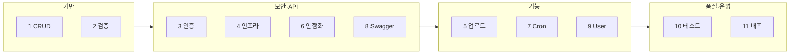

# 개발 과정

영화·감독·장르 REST API를 **11단계**로 확장한 기록입니다.  
아래 **로드맵 표**로 흐름을 먼저 보고, 필요한 단계만 펼쳐 읽으면 됩니다.

---

## 한눈에 보기 (로드맵)

| 단계 | 주제 | 이번에 얻은 것 |
|:--:|------|----------------|
| 1 | 도메인 CRUD | Feature 모듈, TypeORM 관계, 트랜잭션 생성 |
| 2 | 검증·Pipe | ValidationPipe, DTO, 커스텀 Pipe |
| 3 | 인증·인가 | JWT, Passport, RBAC, Middleware |
| 4 | 공통 인프라 | 커서 페이지네이션, TransactionInterceptor |
| 5 | 파일 업로드 | 2-step 업로드 (temp → movie) |
| 6 | 인증 안정화 | 토큰 블락, Rate limit |
| 7 | 스케줄·로깅 | cron, Winston 분리 로깅 |
| 8 | API 문서화 | URI `/v1`, Swagger |
| 9 | User 정리 | `UserService.create` 통합, 단위 테스트 |
| 10 | 테스트 확장 | 통합·E2E, 테스트 헬퍼 |
| 11 | 배포 | EB, GitHub Actions, Migration |



---

## 단계별 상세

### 1단계 · 기반 세팅 & 도메인 CRUD

> **목표** — NestJS + PostgreSQL 위에 Movie / Director / Genre API 뼈대 만들기

| 구분 | 내용 |
|------|------|
| 구조 | Feature 모듈 분리 (`movie`, `director`, `genre`) |
| DB | Movie↔Detail(1:1), Movie↔Genre(N:M), Movie→Director(N:1) |
| 설정 | ConfigModule + Joi, Docker Compose |
| 비즈니스 규칙 | Director `name+dob` Unique · Genre 삭제 시 연결 영화 차단 · Movie 생성 트랜잭션 |

---

### 2단계 · 검증·Pipe·데이터 품질

> **목표** — 잘못된 요청을 앱 진입 전에 걸러내기

- 전역 `ValidationPipe` (`whitelist`, `transform`)
- DTO + `class-validator` / `class-transformer`
- 커스텀 Pipe: `MovieTitleValidationPipe`, `ParseIntPipe`
- 감독 `dob`: `@Type(() => Date)` + `@IsDate()`로 transform·검증 일치

---

### 3단계 · 인증·인가

> **목표** — Basic → JWT → RBAC까지 인증 파이프라인 완성

```
회원가입/로그인 (Basic)
    → access / refresh JWT
    → BearerTokenMiddleware (req.user)
    → AuthGuard (@Public)
    → RBACGuard (@RBAC)
```

| 항목 | 구현 |
|------|------|
| User | `email`, `password`, `Role`, bcrypt (`SALT_ROUNDS`) |
| 회원 생성 | **`UserService.create`** 단일 진입 |
| 전략 | Passport Local / JWT |
| 권한 | `user.role <= 요구 role` — Movie·Genre·Director CUD 분리 |

---

### 4단계 · 공통 인프라 & 목록 API

> **목표** — 목록 API와 트랜잭션·예외 처리 공통화

- **CommonService** — offset + 커서 페이지네이션 (`nextCursor`)
- **Movie 목록** — QueryBuilder, `title` LIKE, 커서 응답 (`data`, `count`, `nextCursor`)
- **TransactionInterceptor** — commit/rollback을 인터셉터에서 처리
- **전역 예외 필터** — Forbidden, QueryFailed 응답 통일

---

### 5단계 · 파일 업로드

> **목표** — 대용량 MP4를 API 본문과 분리해 안전하게 저장

**2-step 플로우**

| 순서 | API | 하는 일 |
|:--:|-----|---------|
| ① | `POST /common/video` | `public/temp`에 임시 저장 → `fileName[]` 반환 |
| ② | `POST /movie` | `files`(temp 참조) → `public/movie/{id}` 이동 + DB 메타 |

- `MovieFilesPipe` — MP4 1~3개, 용량·mimetype 검증, UUID 파일명
- 업로드 경로는 `.gitignore` 처리

---

### 6단계 · 인증 안정화

> **목표** — 로그아웃·무차별 로그인 방어

| 기능 | 설명 |
|------|------|
| 토큰 블락 | 캐시 키 `auth:block:{sha256(token)}` — raw 토큰 미저장 |
| Rate limit | login `@Throttle` + 전역 `ThrottlerGuard` |

---

### 7단계 · 스케줄링 & 로깅

> **목표** — 백그라운드 정리·집계, 로그 목적별 분리

| Cron | 주기 | 역할 |
|------|------|------|
| `deleteExpiredTempFiles` | 매일 자정 | temp 24h 초과 파일 삭제 |
| `calculateMovieLikeCount` | 스케줄 | like/dislike → `Movie` 컬럼 동기화 |

| 로그 | 경로 |
|------|------|
| API 예외 | `logs/error.log` + Console |
| Cron 전용 | `logs/tasks.log` |

---

### 8단계 · API 버저닝 & Swagger

> **목표** — `/v1` 버전 고정 + 클라이언트용 문서

- URI 버저닝 — 기본 prefix `/v1`
- Middleware exclude — `v1/auth/login`, `v1/auth/register` (Basic 충돌 방지)
- Swagger `/api` — register/login은 Basic, 나머지 Bearer
- DTO `@Transform` — `order`, `files` 단일 값 → 배열 정규화

---

### 9단계 · User 정리 & 단위 테스트

> **목표** — 회원 생성 DRY + User 모듈 테스트 기반

- `AuthService.register` → **`userService.create` 위임**
- env: `HASH_ROUNDS` → `SALT_ROUNDS`
- `pnpm test:user` / `test:user:watch` — repository·Config mock

---

### 10단계 · 테스트 확장

> **목표** — 단위 → 통합(실 DB) → E2E(HTTP) 피라미드

| 레이어 | 대상 | 파일 예시 |
|--------|------|-----------|
| 단위 | Service, Controller, Pipe | `*.spec.ts` |
| 통합 | Movie, Genre, Director | `*.integration.spec.ts` |
| E2E | HTTP Supertest | `test/movie.e2e-spec.ts` 등 |

**E2E에서 검증한 것**

- Movie — 404, RBAC CUD, like, 2-step 업로드
- Common — video 업로드 403/400/성공
- Auth — register, login, private (access/refresh)

**공통 헬퍼** (`test/`)

`load-integration-env` · `integration-db.helpers` · `e2e-app.helpers` · `e2e-auth.helpers` · `e2e-upload.helpers`

- 테스트 DB는 반드시 `*_test` (예: `movie_test`)
- 수동 확인: `public/movie/index.html`

→ 실행 방법은 [테스트 문서](./testing.md)

---

### 11단계 · AWS 배포 · CI/CD · Migration

> **목표** — prod에서 `synchronize` 없이 Migration으로 배포

```
main push → GitHub Actions
  → build → migration:run (RDS, SSL)
  → S3 → Elastic Beanstalk
```

| 항목 | 내용 |
|------|------|
| 런타임 | `Procfile` → `node dist/main.js` |
| DB | prod: SSL, `synchronize: false` |
| Migration | `data-source.ts`, `npm run migration:run` |
| 기타 | S3 presigned URL, IAM(CI용) |

→ Secrets·RDS 초기화는 [배포 문서](./deployment.md)

---

## 핵심 설계 포인트

단계를 거치며 유지한 원칙입니다.

| 영역 | 원칙 |
|------|------|
| 레이어 | Controller ↔ Service ↔ Repository/QueryBuilder |
| 회원 | Auth·User 진입점 달라도 **`UserService.create`** 한 곳 |
| 데이터 | FK 검증, N:M relation, 삭제 시 연관 확인 |
| 트랜잭션 | commit/rollback은 **인터셉터**에서 일원화 |
| 인증 | Middleware(파싱·블락) → Guard → RBAC |
| 목록 | offset 학습 후 **커서**로 확장 |
| 업로드 | Multer 저장 + Pipe 검증 (단일/복수 분리) |
| 운영 | cron으로 temp·집계 — API와 분리 |
| 로깅 | API(`error.log`) vs cron(`tasks.log`) 분리 |
| API | `/v1` + Swagger로 Basic/Bearer·DTO 명시 |

---

## 관련 문서

- [트러블슈팅](./troubleshooting.md) — 단계별 이슈 해결 기록
- [테스트 문서](./testing.md) — 명령어·시드 계정
- [배포 문서](./deployment.md) — CI/CD·Secrets
